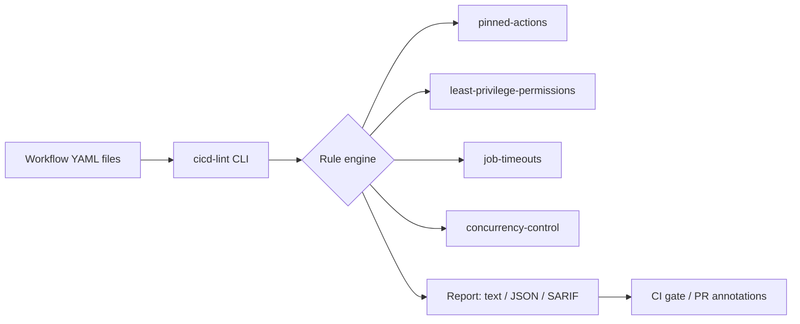

# CI/CD Best Practices

[](LICENSE)
[](https://github.com/abhisheksawant52/cicd-best-practices/actions/workflows/ci.yml)
[](https://www.python.org/)
[](https://github.com/psf/black)

A curated, opinionated reference for building secure and reliable CI/CD
pipelines — shipped with **`cicd-lint`**, a small linter that checks GitHub
Actions workflows against these best practices.

## Overview

Most CI/CD problems are not exotic: unpinned actions, over-broad `GITHUB_TOKEN`
permissions, missing timeouts, and jobs without concurrency control cause the
majority of supply-chain and reliability incidents. This project collects the
practices that prevent them and provides tooling to enforce them automatically.

It is aimed at platform and DevOps engineers who want a house style for
pipelines that can be enforced in code review and in CI itself.

## Architecture



Components:

- **Rule engine** — pluggable checks, each returning findings with severity.
- **CLI (`cicd-lint`)** — discovers `.github/workflows/*.yml`, runs rules, exits
  non-zero on violations above a configurable threshold.
- **Reference templates** — hardened, reusable workflow examples in
  [`templates/workflows/`](templates/workflows/).

## Features

- Lints GitHub Actions workflows for common security & reliability issues.
- Rules: action pinning, least-privilege `permissions`, per-job `timeout-minutes`,
  and `concurrency` groups.
- Text, JSON, and SARIF output (SARIF integrates with GitHub code scanning).
- Reusable, hardened workflow templates you can copy into any repo.
- Zero runtime dependencies beyond `PyYAML` and `click`.

## Tech Stack

Python 3.11+ · Click · PyYAML · pytest · ruff · black · GitHub Actions

## Getting Started

### Prerequisites

- Python 3.11 or newer
- `make` (optional, for convenience targets)

### Install

```bash
python -m venv .venv && source .venv/bin/activate
make install            # pip install -e .[dev]
```

### Run

```bash
# Lint the workflows in the current repository
cicd-lint .github/workflows

# Emit SARIF for GitHub code scanning
cicd-lint .github/workflows --format sarif > cicd-lint.sarif
```

## Project Structure

```
.
├── src/cicd_toolkit/        # cicd-lint implementation
│   ├── cli.py               # Click entrypoint
│   ├── rules.py             # rule definitions
│   └── validator.py         # workflow loading + rule execution
├── templates/workflows/     # hardened reusable workflow examples
├── docs/best-practices.md   # the written guidance
├── tests/                   # pytest suite
└── .github/workflows/ci.yml # this project's own pipeline
```

## Configuration

| Variable / Flag        | Default | Description                                  |
| ---------------------- | ------- | -------------------------------------------- |
| `--format`             | `text`  | Output format: `text`, `json`, or `sarif`.   |
| `--fail-on`            | `error` | Minimum severity that fails the run.         |
| `CICD_LINT_LOG_LEVEL`  | `INFO`  | Logging verbosity.                           |

## Deployment

`cicd-lint` is designed to run in CI. See
[`templates/workflows/reusable-python-ci.yml`](templates/workflows/reusable-python-ci.yml)
for a hardened, reusable pipeline you can call from other repositories.

## Contributing

Contributions are welcome — see [CONTRIBUTING.md](CONTRIBUTING.md) and our
[Code of Conduct](CODE_OF_CONDUCT.md).

## Security

Please report vulnerabilities as described in [SECURITY.md](SECURITY.md).

## License

Released under the [MIT License](LICENSE).
